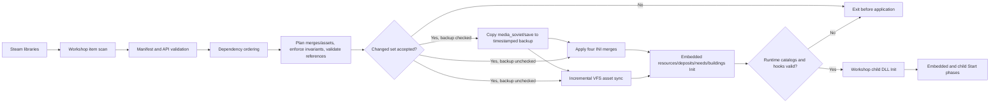

# Soviet Mod Loader architecture

## Upstream contract

The implementation targets TesmioLoader API v4. A normal Tesmio plugin exports
`TsmPluginApiVersion`, `TsmPluginInit`, and optionally `TsmPluginStart`. `Init`
publishes services and reads configuration; `Start` consumes services and
installs dependent hooks. Data crossing the DLL boundary remains POD/C strings.

TesmioLoader discovers ordinary DLLs under `tesmioloader/build/plugins`, but its
enumeration order is not used as a correctness mechanism. The upstream
`buildings`, `deposits`, `needs`, and `resources` sources are built as separate
translation units and linked into `soviet_mod_loader.dll`. Their exports
are renamed internally so the manager controls when each `Init` and `Start`
runs while preserving independent file-scope state.

## Direct Workshop discovery

The loader reads Steam's `HKCU\\Software\\Valve\\Steam\\SteamPath` and
`steamapps/libraryfolders.vdf`, then scans
`steamapps/workshop/content/784150/*/soviet.mod.ini`. `workshop_root` can pin a
custom location. Direct discovery requires no copy or enable step after a user
subscribes to a Workshop item.

Each item receives a metadata fingerprint from relative path, size, and last
write time. The stable iteration order is:

1. dependencies before dependants;
2. ascending `priority`;
3. Workshop folder creation time (`added_utc` can override it);
4. mod id as deterministic tie-breaker.

Later entries win conflicts. The service API in
`include/soviet_mod_loader_api.h` exposes that exact order.

## Merge and state flow

The first run snapshots the existing `plugins/{resources,deposits,needs,
buildings}.ini` files into `soviet_mod_loader/base`. Generated files are written
through a temporary file and atomically replaced only when bytes changed.

Merge and asset plans are computed without writes before initialization. Their
resolved order, fingerprints, states, and conflict details form
`confirmation.index`. With `confirmation_mode = changes`, a changed signature
opens a native Windows confirmation; refusal terminates the process before
base snapshots, merged INIs, catalogs, assets, embedded components, or child
hooks are applied. `always` prompts every launch and `never` explicitly opts
out. Task Dialog is preferred for expandable details, with MessageBox as the
compatibility fallback.

The Task Dialog includes a verification checkbox to back up saved games,
checked by default. After acceptance and before any application, the complete
`media_soviet/save` tree is copied to a fresh
`media_soviet/save_backups/SML-YYYYMMDD-HHMMSS[-N]` directory. A missing source
is a successful no-op. Any copy failure displays an English blocking error and
terminates before INIs, catalogs, assets, plugin settings, or hooks change. The
MessageBox fallback uses the checked default because it cannot render a
checkbox.

Before that confirmation, the loader compares the planned building IDs with
directories in `media_soviet/workshop_wip` whose numeric names fall in the
internal `9100000000..9199999999` range. A directory is unsafe when its ID is
absent from the plan, its `tesmioloader.stamp` is missing, or the stamped
section differs from the catalog assignment. Missing expected directories are
safe because the embedded buildings component creates them after acceptance.
Any unsafe directory is listed in a blocking warning and the process exits
before application; deletion remains an explicit user action.

For `resources` and `needs`, conflicts are resolved per section/key. For
`deposits` and `buildings`, a named content section is atomic so repeated keys
such as `line` stay intact. Core settings sections are protected unless a mod
explicitly sets `allow_settings = 1`.

Content-required settings are stronger than both the baseline and
`allow_settings`: a non-empty resource list forces `hook=2`; deposits force
`code_patch=1`; needs force `enabled`, `demand`, and `storage`; buildings force
`enabled` and the reserved `media_soviet\\workshop_wip` output. Static
validation resolves building production/consumption/storage, deposit icons,
needs, resource clones, and building donor assets before confirmation.

After application, the manager validates private component status interfaces:
resource names/count, deposit count plus type/map hooks, need count, and
building enabled/complete/incomplete counts. These are internal link-time
contracts and do not change the public `SmlApi`. The confirmation signature is
persisted only after this runtime validation passes.

States are `active`, `added`, `conflict`, `disabled`, `incompatible`,
`missing dependency`, and `error`. A conflict is non-fatal: the loser stays
loaded for all non-conflicting content and records which later mod replaced the
entry. Disabled or incompatible mods contribute nothing. A malformed mod is
isolated and appears as `error`; other mods continue.

## Internal numeric catalog

Globally unique numbers are not part of the mod-author contract. Before the
embedded plugins initialize, the manager injects values from the persistent
`soviet_mod_loader/catalog.ini`:

| Declaration | Internal assignment |
|---|---|
| building section | Workshop-style ID in `9100000000..9199999999` |
| deposit section | type in `10..127` |
| ordinary deposit | emitted as `map = auto`; upstream assigns the channel |
| resource/need list | stable append-only ordering |

Assignments are keyed by mod ID plus section name, imported from legacy
explicit values when those values are free, and never renumbered later. Hashing
selects the first candidate and deterministic probing resolves collisions. The
catalog is append-only so removing one subscription cannot change another
mod's save-facing identifiers. Explicit resource slot prefixes are stripped.

Every deposit has any source `map` and `component` discarded and is emitted as
`map = auto` with no component. Channel ownership therefore remains entirely
inside the incorporated upstream deposits implementation. Generated merged
INIs still contain the injected deposit `type` because the upstream parser
requires it; source mods do not.

Assets are read below each mod's `assets` directory and synchronized to the
loader VFS by relative path. In a source layout where the DLL base is
`tesmioloader/build`, the destination is explicitly `tesmioloader/vfs`, not
`tesmioloader/build/vfs`. A distributed layout with the DLL directly inside
`tesmioloader` continues to use `tesmioloader/vfs`. Only changed bytes are copied. Removed assets are
deleted only when the staged file still matches the hash last written by this
loader, preserving a locally edited file. TesmioLoader API v4 publishes the
resolved root as `TsmHost::vfsRoot`; it does not publish a direct VFS mount API,
so staging remains necessary.

The incorporated deposits component receives this resolved VFS root directly.
Its blank `resourcemapN` fallback is therefore created under the same VFS the
host reads, including source layouts where the DLL lives in `build`. A missing
or invisible fallback is not published as a live texture, and the generated
deposit dispatch returns zero richness when its texture slot is null instead of
calling the game sampler.

### Universal per-game deposit maps

Map origin is deliberately irrelevant. Whenever a world loads, every declared
extra deposit without an initialized channel receives fixed multi-scale
smoothed fractal noise. A random per-game seed makes separate games differ;
the cataloged type and section name derive an independent seed for each
deposit. Up to 32 cataloged deposits occupy the 32 channels in
`resourcemap3..resourcemap10`.

An optional per-deposit `richness_offset` in `[-0.25,+0.25]` is added to the
normalized fractal field before the fixed `0.61` threshold. Positive values
increase both coverage and intensity; negative values reduce both. Zero is the
compatibility default. The setting is consulted only while filling an
uninitialized channel, so changing it never rewrites a persisted DDS.

`soviet_mod_loader_deposits.ini`, saved beside the world, records format, seed,
and the map/component owned by every initialized catalog type. When a mod is
installed later, its absent entry causes only its channel to be generated; all
other bytes are copied from the existing DDS. A legacy DDS with no manifest is
opaque and is preserved completely, then its currently associated channels are
registered on the next save. This prioritizes existing painted or depleted
data over retroactive generation.

Generated load sources live only in
`tesmioloader/vfs/media_soviet/tesmio/procedural/<game-hash>`; source DDS files
are never edited during loading. The existing save hook persists eligible
textures. The manifest path is resolved physically against the game directory's
`media_soviet`: relative forms such as `saved_last`, `campaign1`,
`save/<world>`, and an optional `media_soviet` prefix are accepted. Absolute
paths are accepted only below that same root; parent traversal is rejected. The
directory is created when needed and the manifest is atomically replaced.
Invalid existing DDS files are left untouched and not saved again. A failed new generation uses an unsaved
blank at runtime, while a missing live texture samples as zero richness.

Native DLLs listed under `[hooks]` are loaded from their Workshop folder. Their
API version and required exports are checked before `Init`; faults and non-zero
returns disable only that hook. Optional `Start` calls are deferred to the
Soviet Mod Loader's own `Start`, preserving the upstream two-phase contract.

At startup the manager writes `buildings=0`, `resources=0`, `deposits=0`, and
`needs=0` under `tesmioloader.ini [plugins]`. This prevents the external copies
from installing duplicate hooks. If an external copy was already mapped before
the manager on the first migration launch, its embedded counterpart is skipped
and the log requests one restart; subsequent launches use only the centralized
implementations. `buildings` is the deliberate exception: because it installs
no hooks and only writes generated Workshop folders, the embedded copy may run
again after the merge on that first launch. This fixes the original stale
`buildings.ini` problem immediately without duplicating process patches.

## Compatibility boundary

The project mirrors the current upstream `TsmHost` v4 layout and reports API 4.
It checks `structSize` before reading the appended `vfsRoot` field. Workshop
hooks may declare a supported host range including API 3 or 4 and fail softly
outside it. Existing Tesmio plugins retain their own verified hook/prologue
protections against game updates.

The synchronization baseline is TesmioLoader commit
`3baa141f9f08921aea9c95f0a400289cabd9960a` (b0.3.6). `resources` and `needs`
match their active upstream sources except for the local include and internal,
non-exported entry points. `deposits` carries those changes plus the SML's
universal generation and persistence layer. `buildings`, parked by the upstream
b0.3.6 build, remains incorporated because it is address-independent and part
of the SML content contract. The resulting DLL exposes only the Soviet Mod
Loader's three Tesmio exports.
